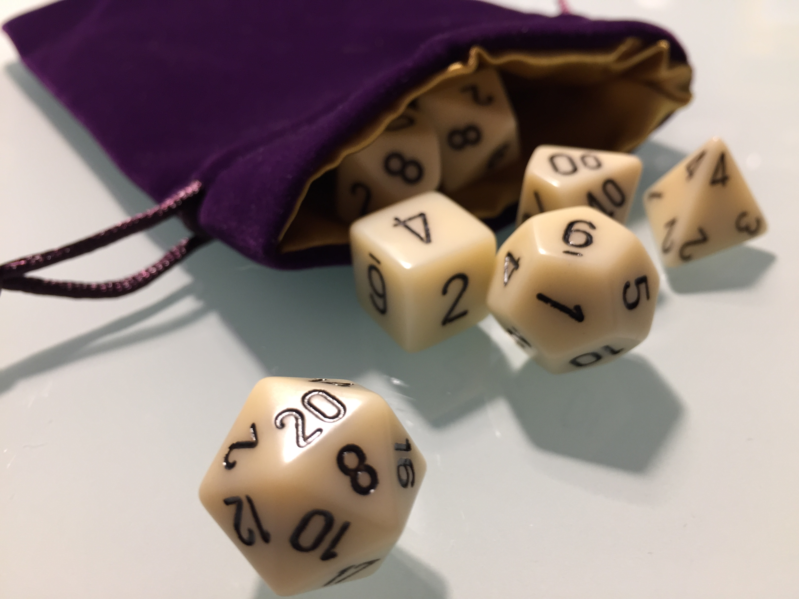

Welcome to the **[Ahrda](World/Arhda.md)** Wiki\!

On this Wiki you will find just about everything regarding the Dungeons
& Dragons [Adventures](/adventures),
[characters](Characters), and
[locations](Regions) on the fictional world of
[Ahrda](World/Arhda.md).

If you're a new player and this seems a bit overwhelming, check out the
[new players page](/New_Players.md) first.

## Key Pages

  - **[New Players](New_Players.md)** - a good starting point
    if you're a new player
  - [Non-Base Material](Utilties/Non-Base_Material.md) - a list of all
    the non-base material provided in the expansion modules (spells,
    classes, backgrounds, etc.)
  - [Ahrda](World/Arhda.md) - overview of the world and a good entry
    point to the rest of the Wiki

## Campaigns

  - **[Dungeons & Drunkards](Adventures/Dungeons_&_Drunkards)** - Main
    Friday night campaign
  - **[A Darker Heart](Adventures/A_Darker_Heart.md "wikilink")** - Bi-weekly Sunday
    evening campaign
  - [Seagulls & Calamari](Adventures/Seagulls_&_Calamari.md "wikilink") - One (well,
    really two) shot campaign
  - [Dungeons & Dwarves](Adventures/Dungeons_&_Dwarves.md "wikilink") - A two-shot
    all-dwarven campaign

## Lore and History

  - [Mhur](Regions/Mhur.md) - Gruumsh and the position of Orcs in the
    world
  - [Ascension of D'arr](Timeline/Ascension_of_D'arr.md) - Tells the
    tale of D'arr, dragon queen
  - [Elven Civil War](Timeline/Elven_Civil_War.md) - How Lolth, the
    Spider Queen, broke apart the Elves
